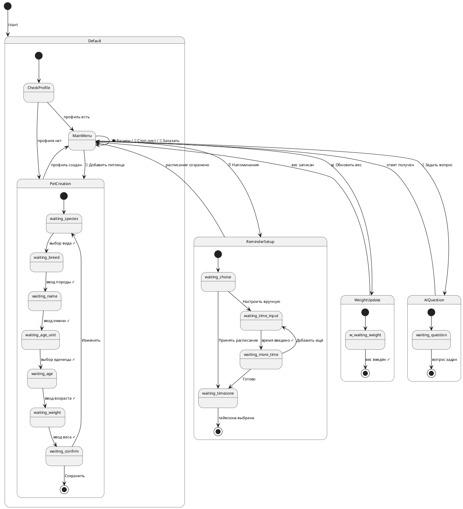

# FSM Telegram-бота — PetFeed v1.0

## Что такое FSM в контексте бота

FSM (Finite State Machine) — конечный автомат состояний. Бот всегда находится в одном из состояний. Каждое сообщение или нажатие кнопки переводит бота в следующее состояние.

**Хранение состояния:** Redis, ключ `fsm:{telegram_id}`, TTL 30 минут.

**Реализация:** aiogram 3 + `aiogram.fsm.state.StatesGroup`

---

## Состояния FSM

### Группа: Default (нет активного состояния)
Пользователь находится в главном меню. Бот ждёт команду или нажатие кнопки.

| Триггер | Действие | Следующее состояние |
|---|---|---|
| `/start` | Проверить профиль пользователя | `PetCreation.waiting_species` или `MainMenu` |
| `/menu` | Показать главное меню | `MainMenu` |
| Свободный текст | Передать в AI-ассистент | `MainMenu` |

---

### Группа: PetCreation — создание профиля питомца

```python
class PetCreation(StatesGroup):
    waiting_species  = State()
    waiting_breed    = State()
    waiting_name     = State()
    waiting_age_unit = State()  # выбор единицы возраста
    waiting_age      = State()
    waiting_weight   = State()
    waiting_confirm  = State()
```

| Состояние | Что ждёт бот | Валидация | Следующее состояние | Ошибка |
|---|---|---|---|---|
| `waiting_species` | Выбор вида (кнопка) | Из enum: cat/dog/rodent/bird/reptile | `waiting_breed` | Повтор кнопок |
| `waiting_breed` | Текст или "Метис" | max 100 символов | `waiting_name` | Повтор запроса |
| `waiting_name` | Текст — имя питомца | max 100 символов, не пустое | `waiting_age_unit` | Повтор запроса |
| `waiting_age_unit` | Кнопка "В месяцах" / "В годах" | — | `waiting_age` | Повтор кнопок |
| `waiting_age` | Число (месяцы или годы) | Целое > 0; годы × 12 = месяцы | `waiting_weight` | Ошибка + повтор |
| `waiting_weight` | Число — вес в кг | Float, > 0, < 1000 | `waiting_confirm` | Ошибка + повтор |
| `waiting_confirm` | "Сохранить" / "Изменить" | — | `MainMenu` / `waiting_species` | — |

---

### Группа: ReminderSetup — настройка напоминаний

```python
class ReminderSetup(StatesGroup):
    waiting_choice      = State()  # принять/настроить вручную
    waiting_time_input  = State()  # ввод времени HH:MM
    waiting_more_time   = State()  # добавить ещё? да/нет
    waiting_timezone    = State()  # выбор часового пояса
```

| Состояние | Что ждёт бот | Валидация | Следующее состояние | Ошибка |
|---|---|---|---|---|
| `waiting_choice` | Кнопка: принять / вручную | — | `waiting_timezone` / `waiting_time_input` | — |
| `waiting_time_input` | Текст HH:MM | Regex `^\d{2}:\d{2}$`, 00:00–23:59 | `waiting_more_time` | Ошибка + повтор |
| `waiting_more_time` | Кнопка: да / нет | COUNT <= 6 | `waiting_time_input` / `waiting_timezone` | Лимит 6 напом. |
| `waiting_timezone` | Кнопка выбора таймзоны | IANA timezone | `MainMenu` (сохранение) | — |

---

### Группа: WeightUpdate — обновление веса

```python
class WeightUpdate(StatesGroup):
    waiting_weight = State()
```

| Состояние | Что ждёт бот | Валидация | Следующее состояние | Ошибка |
|---|---|---|---|---|
| `waiting_weight` | Число — новый вес | Float, > 0, < 1000 | `MainMenu` (сохранение) | Ошибка + повтор |

---

### Группа: AiQuestion — вопрос AI-ассистенту

```python
class AiQuestion(StatesGroup):
    waiting_question = State()
```

| Состояние | Что ждёт бот | Валидация | Следующее состояние | Ошибка |
|---|---|---|---|---|
| `waiting_question` | Свободный текст | 5–1000 символов | `MainMenu` (после ответа) | Ошибка + повтор |

---

## Главное меню (MainMenu)

Кнопки главного меню и их действия:

| Кнопка | callback_data | Действие |
|---|---|---|
| 🍽 Рацион питания | `menu:nutrition` | Запрос рациона, переход к выбору цели |
| 🚫 Что нельзя давать | `menu:stoplist` | Показать стоп-лист |
| ⏰ Напоминания | `menu:reminders` | Вход в `ReminderSetup` |
| 📊 Обновить вес | `menu:weight` | Вход в `WeightUpdate` |
| 🛒 Заказать корм | `menu:order` | Показать товары партнёра |
| 🤖 Задать вопрос | `menu:ai` | Вход в `AiQuestion` |
| 🐾 Мой питомец | `menu:pet` | Показать профиль питомца |

---

## Диаграмма состояний (PlantUML)



---

## Обработка отмены и таймаута

| Ситуация | Поведение |
|---|---|
| Пользователь пишет `/cancel` в любом состоянии | Сброс FSM, возврат в `MainMenu` |
| TTL Redis истёк (30 мин без активности) | FSM сбрасывается, при следующем сообщении — `MainMenu` |
| Пользователь пишет `/start` в середине диалога | Сброс FSM, начало с начала |
| Нажатие "Назад" | Откат на предыдущее состояние (если предусмотрено) |

---

## Реализация в aiogram 3 (пример)

```python
from aiogram import Router, F
from aiogram.fsm.context import FSMContext
from aiogram.fsm.state import State, StatesGroup
from aiogram.types import Message, CallbackQuery

router = Router()

class PetCreation(StatesGroup):
    waiting_species  = State()
    waiting_breed    = State()
    waiting_name     = State()
    waiting_age_unit = State()
    waiting_age      = State()
    waiting_weight   = State()
    waiting_confirm  = State()

# Вход в создание профиля
@router.callback_query(F.data == "menu:add_pet")
async def start_pet_creation(callback: CallbackQuery, state: FSMContext):
    await state.set_state(PetCreation.waiting_species)
    await callback.message.answer(
        "Выбери вид животного:",
        reply_markup=species_keyboard()
    )

# Обработка выбора вида
@router.callback_query(PetCreation.waiting_species, F.data.startswith("species:"))
async def process_species(callback: CallbackQuery, state: FSMContext):
    species = callback.data.split(":")[1]
    await state.update_data(species=species)
    await state.set_state(PetCreation.waiting_breed)
    await callback.message.answer("Введи породу (или нажми 'Метис'):")

# Отмена в любом состоянии
@router.message(F.text == "/cancel")
async def cancel_handler(message: Message, state: FSMContext):
    await state.clear()
    await message.answer("Отменено. Возвращаемся в главное меню.",
                         reply_markup=main_menu_keyboard())
```

---

*Документ создан: 2026-04-18*
*Связанные артефакты: seq_uc001_create_pet_profile.plantuml, petfeed_backend.md, c4_Level_2_containers_diagram_PetFeed_v1.plantuml*
