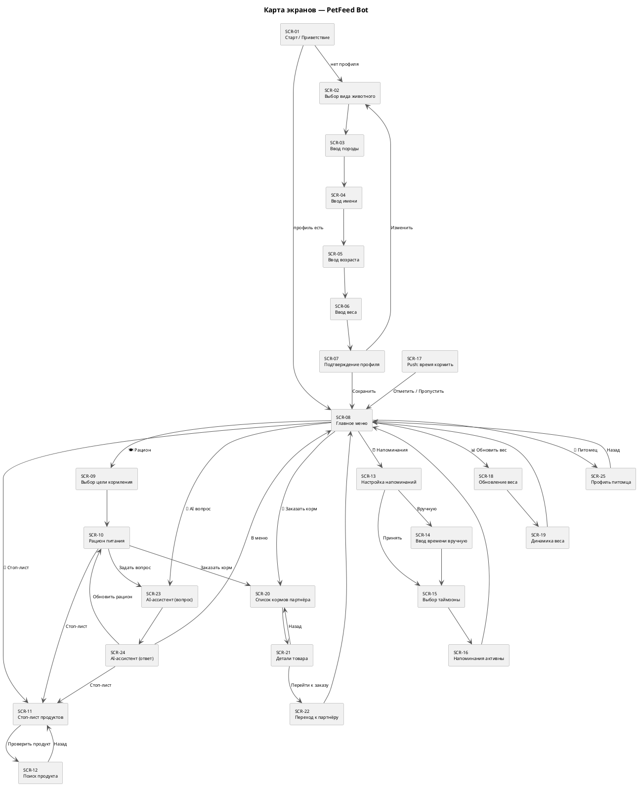

# UX: Стратегия экранов и вайрфреймы — PetFeed Telegram Bot v1.0

## Принципы дизайна бота

- **Один экран — одно действие.** Не перегружать одно сообщение
- **Кнопки вместо текста.** Там где есть выбор — inline-кнопки, не ввод текста
- **Прогресс онбординга.** Показывать шаг X из N при создании профиля
- **Эмодзи как иконки.** Визуальное разделение блоков без картинок
- **Главное меню всегда доступно.** Команда `/menu` работает из любого состояния

---

## Карта экранов (Screen Map)



---

## Вайрфреймы экранов

> Формат: схематичное отображение Telegram-сообщения.
> `[ Кнопка ]` — inline-кнопка. `___` — поле ввода текста.

---

### SCR-01: Старт / Приветствие

```
┌─────────────────────────────────────┐
│ 🐾 Добро пожаловать в PetFeed!      │
│                                     │
│ Я помогу правильно кормить твоего   │
│ питомца — кошку, собаку, хомяка,   │
│ черепаху или попугая.               │
│                                     │
│ Давай создадим профиль питомца —    │
│ это займёт 2 минуты.                │
│                                     │
│         [ 🐾 Начать ]               │
└─────────────────────────────────────┘
```

---

### SCR-02: Выбор вида животного

```
┌─────────────────────────────────────┐
│ Шаг 1 из 5                         │
│ Кто твой питомец?                   │
│                                     │
│  [ 🐱 Кошка ]    [ 🐶 Собака ]     │
│  [ 🐹 Грызун ]   [ 🦜 Птица ]      │
│        [ 🦎 Рептилия ]              │
└─────────────────────────────────────┘
```

---

### SCR-03: Ввод породы

```
┌─────────────────────────────────────┐
│ Шаг 2 из 5                         │
│ Какая порода? 🐱                    │
│                                     │
│ Напиши породу или нажми кнопку:     │
│                                     │
│ ___________________________________│
│                                     │
│      [ Метис / Не знаю ]            │
└─────────────────────────────────────┘
```

---

### SCR-04: Ввод имени

```
┌─────────────────────────────────────┐
│ Шаг 3 из 5                         │
│ Как зовут питомца? 🏷               │
│                                     │
│ ___________________________________│
└─────────────────────────────────────┘
```

---

### SCR-05: Ввод возраста

```
┌─────────────────────────────────────┐
│ Шаг 4 из 5                         │
│ Сколько месяцев Барсику? 📅         │
│                                     │
│ Введи число месяцев.                │
│ Например: 24 (= 2 года)             │
│                                     │
│ ___________________________________│
└─────────────────────────────────────┘
```

---

### SCR-06: Ввод веса

```
┌─────────────────────────────────────┐
│ Шаг 5 из 5                         │
│ Сколько весит Барсик? ⚖️            │
│                                     │
│ Введи вес в кг.                     │
│ Например: 5.2                       │
│                                     │
│ ___________________________________│
└─────────────────────────────────────┘
```

---

### SCR-07: Подтверждение профиля

```
┌─────────────────────────────────────┐
│ Проверь данные питомца ✅            │
│                                     │
│ 🐱 Барсик                           │
│ Порода:   Мейн-кун                  │
│ Возраст:  24 мес (2 года)           │
│ Вес:      5.2 кг                    │
│                                     │
│  [ ✅ Сохранить ]  [ ✏️ Изменить ]  │
└─────────────────────────────────────┘
```

---

### SCR-08: Главное меню

```
┌─────────────────────────────────────┐
│ 🐾 Барсик | Мейн-кун | 5.2 кг      │
│                                     │
│  [ 🍽 Рацион питания ]              │
│  [ 🚫 Что нельзя давать ]           │
│  [ ⏰ Напоминания о кормлении ]     │
│  [ 📊 Обновить вес ]                │
│  [ 🛒 Заказать корм ]               │
│  [ 🤖 Задать вопрос AI ]            │
│  [ 🐾 Профиль питомца ]             │
└─────────────────────────────────────┘
```

---

### SCR-09: Выбор цели кормления

```
┌─────────────────────────────────────┐
│ 🍽 Рацион для Барсика               │
│                                     │
│ Выбери цель кормления:              │
│                                     │
│  [ ⚖️ Поддержание веса ]            │
│  [ 📉 Похудение ]                   │
│  [ 📈 Набор веса ]                  │
└─────────────────────────────────────┘
```

---

### SCR-10: Рацион питания

```
┌─────────────────────────────────────┐
│ 🍽 Рацион Барсика (Мейн-кун)        │
│ Цель: поддержание веса              │
│                                     │
│ 📊 Суточная норма: 219 ккал         │
│ 🕐 Кормлений в день: 2              │
│ 🥣 Размер порции: ~27г              │
│                                     │
│ ✅ Можно давать:                    │
│ • Куриная грудка варёная            │
│ • Индейка                           │
│ • Рис (в малых количествах)         │
│                                     │
│ 🚫 Нельзя: лук, шоколад, виноград  │
│                                     │
│ [ 🛒 Заказать корм ]               │
│ [ ⏰ Настроить напоминания ]        │
│ [ 🤖 Задать вопрос ]               │
└─────────────────────────────────────┘
```

---

### SCR-11: Стоп-лист продуктов

```
┌─────────────────────────────────────┐
│ 🚫 Что нельзя давать Барсику        │
│                                     │
│ ☠️ Смертельно опасно:               │
│ • Шоколад — теобромин токсичен      │
│ • Ксилит — поражает печень          │
│                                     │
│ 🚫 Опасно:                          │
│ • Лук, чеснок — анемия             │
│ • Виноград — почечная нед.          │
│                                     │
│ ⚠️ С осторожностью:                 │
│ • Молоко — непереносимость лактозы  │
│                                     │
│ [ 🔍 Проверить продукт ]            │
│ [ ← Назад в меню ]                 │
└─────────────────────────────────────┘
```

---

### SCR-12: Поиск продукта

```
┌─────────────────────────────────────┐
│ 🔍 Проверь продукт                  │
│                                     │
│ Напиши название продукта:           │
│ ___________________________________│
│                                     │
│ — — — — — — — — — — — — — — — —    │
│ Результат для "авокадо":            │
│                                     │
│ 🚫 Авокадо — ОПАСНО                 │
│ Персин вызывает рвоту и диарею      │
│ у кошек                             │
│                                     │
│ [ 🔍 Проверить другой ]             │
└─────────────────────────────────────┘
```

---

### SCR-13: Настройка напоминаний

```
┌─────────────────────────────────────┐
│ ⏰ Напоминания для Барсика           │
│                                     │
│ Рекомендуем кормить 2 раза в день:  │
│ 08:00 и 18:00                       │
│                                     │
│  [ ✅ Принять расписание ]           │
│  [ ✏️ Настроить вручную ]           │
│  [ 🔕 Выключить все ]               │
└─────────────────────────────────────┘
```

---

### SCR-16: Напоминания активны

```
┌─────────────────────────────────────┐
│ ✅ Напоминания настроены!            │
│                                     │
│ Барсик будет накормлен вовремя 🐱   │
│                                     │
│ ⏰ 08:00 — Первое кормление         │
│ ⏰ 18:00 — Второе кормление         │
│ 🌍 Часовой пояс: Москва (UTC+3)     │
│                                     │
│  [ ✏️ Изменить ]  [ 🔕 Выключить ] │
│  [ ← Главное меню ]                │
└─────────────────────────────────────┘
```

---

### SCR-17: Push — время кормить

```
┌─────────────────────────────────────┐
│ ⏰ Время кормить Барсика!            │
│                                     │
│ 🕗 08:00 | Первое кормление         │
│ 🥣 Порция: ~27г                     │
│                                     │
│  [ ✅ Покормлен ]  [ ⏭ Пропустить ]│
└─────────────────────────────────────┘
```

---

### SCR-18: Обновление веса

```
┌─────────────────────────────────────┐
│ 📊 Обновить вес Барсика             │
│                                     │
│ Последний вес: 5.2 кг               │
│ Дата: 11 апреля 2026                │
│                                     │
│ Введи новый вес в кг:               │
│ ___________________________________│
└─────────────────────────────────────┘
```

---

### SCR-19: Динамика веса

```
┌─────────────────────────────────────┐
│ 📊 Вес Барсика обновлён             │
│                                     │
│ Было:    5.2 кг (11 апр)            │
│ Стало:   5.4 кг (18 апр)            │
│ Динамика: +0.2 кг (+3.8%) ↑        │
│                                     │
│ ✅ Изменение в норме                 │
│ Рацион остаётся прежним             │
│                                     │
│ [ ← Главное меню ]                 │
└─────────────────────────────────────┘

— — — ВАРИАНТ при критическом изменении — — —

│ ⚠️ Вес вырос на 11% за неделю!     │
│ Рекомендуем проконсультироваться    │
│ с ветеринаром                       │
│ Рацион пересчитан                   │
│                                     │
│ [ 🍽 Новый рацион ] [ ← Меню ]     │
```

---

### SCR-20: Список кормов партнёра

```
┌─────────────────────────────────────┐
│ 🛒 Корм для Барсика (Мейн-кун)      │
│                                     │
│ Рекомендуемые варианты:             │
│                                     │
│ [ Royal Canin Maine Coon — 1 890₽ ]│
│ [ Hill's Science Plan — 2 100₽ ]   │
│ [ Purina Pro Plan — 1 650₽ ]       │
│                                     │
│ Партнёр: ZooShop 🏪                 │
│                                     │
│ [ ← Назад ]                        │
└─────────────────────────────────────┘
```

---

### SCR-21: Детали товара

```
┌─────────────────────────────────────┐
│ 🛒 Royal Canin Maine Coon           │
│                                     │
│ Бренд:   Royal Canin                │
│ Объём:   400г                       │
│ Цена:    1 890 ₽                    │
│ Магазин: ZooShop                    │
│                                     │
│ Подходит для: Мейн-кун, взрослые   │
│                                     │
│ [ ✅ Перейти к заказу ]             │
│ [ ← Назад к списку ]               │
└─────────────────────────────────────┘
```

---

### SCR-22: Переход к партнёру

```
┌─────────────────────────────────────┐
│ 🛒 Переходишь в ZooShop             │
│                                     │
│ Royal Canin Maine Coon — 1 890₽    │
│                                     │
│ Оформление и оплата — на сайте      │
│ партнёра. Мы получим уведомление    │
│ о заказе автоматически.             │
│                                     │
│ [ 🔗 Открыть ZooShop ]             │
│ [ ← Отмена ]                       │
└─────────────────────────────────────┘
```

---

### SCR-23 / SCR-24: AI-ассистент

```
┌─────────────────────────────────────┐
│ 🤖 AI-ассистент                     │
│                                     │
│ Задай вопрос о питании Барсика.     │
│ Осталось вопросов сегодня: 7 из 10  │
│                                     │
│ ___________________________________│
└─────────────────────────────────────┘

— — — ПОСЛЕ ВВОДА ВОПРОСА — — —

┌─────────────────────────────────────┐
│ 🤖 Ответ AI-ассистента              │
│                                     │
│ ❓ Можно ли кормить мейн-куна       │
│    сырой рыбой?                     │
│                                     │
│ Сырая рыба не рекомендована для     │
│ кошек — она содержит тиаминазу,     │
│ которая разрушает витамин B1.       │
│ Давай рыбу варёной, не чаще 2 раз  │
│ в неделю.                           │
│                                     │
│ ⚠️ Не является ветеринарной         │
│    консультацией                    │
│                                     │
│ Осталось вопросов: 6 из 10          │
│                                     │
│ [ 🍽 Обновить рацион ]              │
│ [ 🚫 Проверить стоп-лист ]          │
│ [ 🤖 Ещё вопрос ]                  │
└─────────────────────────────────────┘
```

---

### SCR-25: Профиль питомца

```
┌─────────────────────────────────────┐
│ 🐾 Профиль питомца                  │
│                                     │
│ Имя:     Барсик                     │
│ Вид:     🐱 Кошка                   │
│ Порода:  Мейн-кун                   │
│ Возраст: 24 мес (2 года)            │
│ Вес:     5.4 кг                     │
│ Цель:    Поддержание веса           │
│                                     │
│ [ ✏️ Редактировать профиль ]        │
│ [ ← Главное меню ]                 │
└─────────────────────────────────────┘
```

---

## Сводная таблица экранов

| ID | Экран | FSM состояние | Триггер |
|---|---|---|---|
| SCR-01 | Старт | Default | /start |
| SCR-02 | Выбор вида | PetCreation.waiting_species | SCR-01 |
| SCR-03 | Ввод породы | PetCreation.waiting_breed | SCR-02 |
| SCR-04 | Ввод имени | PetCreation.waiting_name | SCR-03 |
| SCR-05 | Ввод возраста | PetCreation.waiting_age | SCR-04 |
| SCR-06 | Ввод веса | PetCreation.waiting_weight | SCR-05 |
| SCR-07 | Подтверждение | PetCreation.waiting_confirm | SCR-06 |
| SCR-08 | Главное меню | Default/MainMenu | SCR-07, /menu |
| SCR-09 | Выбор цели | Default | SCR-08 |
| SCR-10 | Рацион | Default | SCR-09 |
| SCR-11 | Стоп-лист | Default | SCR-08, SCR-10 |
| SCR-12 | Поиск продукта | Default | SCR-11 |
| SCR-13 | Настройка напоминаний | ReminderSetup.waiting_choice | SCR-08 |
| SCR-14 | Ввод времени | ReminderSetup.waiting_time_input | SCR-13 |
| SCR-15 | Выбор таймзоны | ReminderSetup.waiting_timezone | SCR-13, SCR-14 |
| SCR-16 | Напоминания активны | Default | SCR-15 |
| SCR-17 | Push кормление | Default | APScheduler |
| SCR-18 | Обновление веса | WeightUpdate.waiting_weight | SCR-08 |
| SCR-19 | Динамика веса | Default | SCR-18 |
| SCR-20 | Список кормов | Default | SCR-08, SCR-10 |
| SCR-21 | Детали товара | Default | SCR-20 |
| SCR-22 | Переход к партнёру | Default | SCR-21 |
| SCR-23 | AI вопрос | AiQuestion.waiting_question | SCR-08, SCR-10 |
| SCR-24 | AI ответ | Default | SCR-23 |
| SCR-25 | Профиль питомца | Default | SCR-08 |

---

*Документ создан: 2026-04-18*
*Связанные артефакты: bot_fsm.md, use_cases_uc.md, activity_diagrams*
